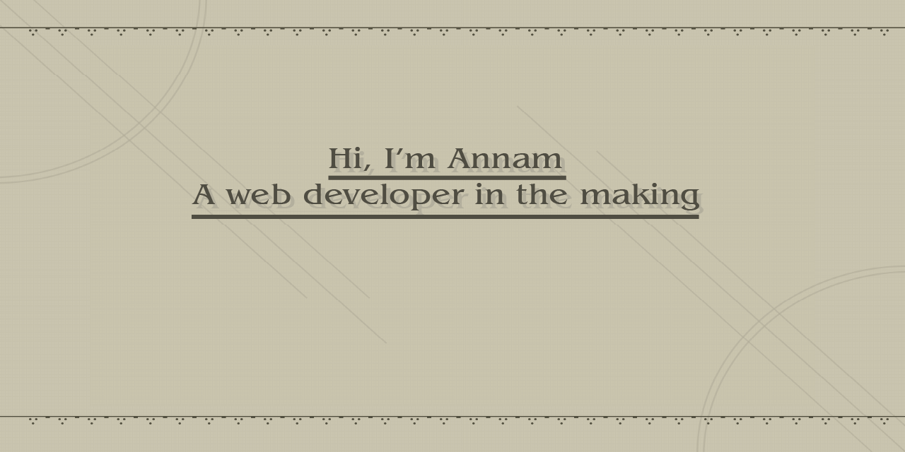

## :mushroom: ᴀʙᴏᴜᴛ ᴍᴇ :mushroom:

**Passionate french student in Web Development**

* :school: IIM Digital School

* :e-mail: annam.tran@edu.devinci.fr

* 💬 French (Native), English (C1), Chinese (B1), Vietnamese (B1)

* :heart: Travelling, Cooking, Gaming

* :airplane: UK, Belgium, Netherlands, Germany, Austria, Italy, Spain Canada, US, Vietnam, Thailand 

## :toolbox: ʟᴀɴɢᴜᴀɢᴇꜱ & ᴛᴏᴏʟꜱ :toolbox:

 
    
    
    
     
     
    

    
    
    
    
    
    

 

